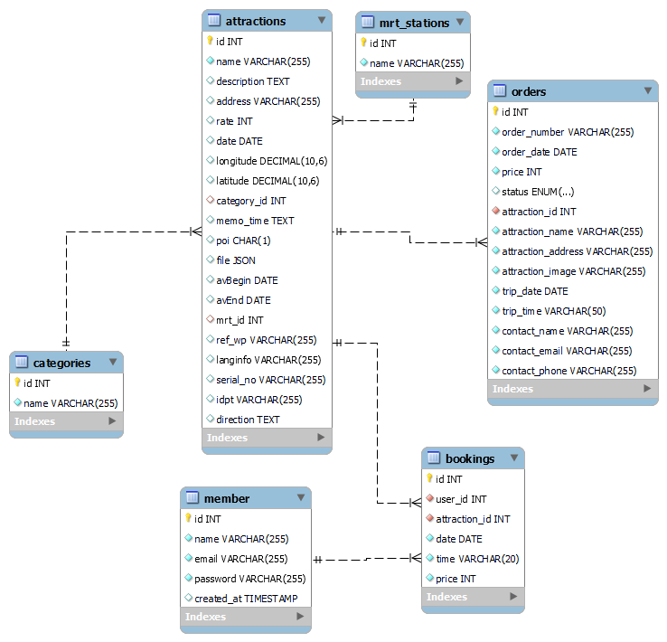

# Taipei Day Trip
Taipei Day Trip is a tourism e-commerce website that introduces more than 50 attractions and integrates member, payment, and cart systems, allowing members to book schedules and pay online.

1. Search attractions by entering attraction name, MRT station name, or keywords.
2. Use the search feature to obtain detailed information about attractions and book trips
3. Complete payment through the TapPay payment service
4. Scrollable presentation of attraction information
5. Carousel Slider of attraction images

### Test Card Number
| Card Number | 424242442424242 |
| --- | --- |
| M / Y | 01 / 23 |
| CVV | 123 |

## Tech Stack
Develop based on frontend-backend separation.

### Front-end Skills
1. Created Infinite Scroll and Carousel Slider by pure **JavaScript**
2. Support **RWD**

### Back-end Skills
1. Developed RESTful APIs by using **Python Flask** and **MySQL** 
2. Integrated **TapPay SDK** to develop payment system
3. Used **AWS EC2** services for deployment

### Database structure

- attractions, mrt_stations, categories store data related to attractions and MRT stations.
- member, bookings, orders store data related to member info, booking cart and orders.
### Develop Tools
**GitHub** to do Git version control.